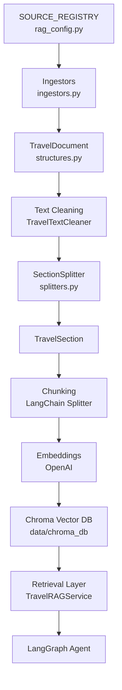

# 📘 Travel RAG Module

<p align="left">
  
  
  
  
  
</p>

This module implements the Retrieval-Augmented Generation (RAG) layer for a travel-focused AI agent. It collects curated
travel content, structures it, splits it semantically, generates embeddings, and stores it in a Chroma vector database
for efficient retrieval.

The system is designed as an **offline-first indexing pipeline** that integrates into a larger **agentic AI architecture
using LangGraph**.

---

## ⚠️ REQUIRED SETUP (IMPORTANT)

### 1. Environment Variables

You MUST create a `.env` file in the root of the project with:

```env
LANGSMITH_TRACING=true
LANGSMITH_API_KEY=your_key_here
OPENAI_API_KEY=your_key_here
GIT_HUB_JHP=your_key_here
```

⚠️ Without these keys:

* embeddings will fail
* observability will not work
* the system will not run correctly

---

### 2. Vector Database Setup

You MUST do one of the following:

### Option A — Use Prebuilt DB (Recommended)

1. Locate:

```text
chroma_db.zip
```

2. Extract it into:

```text
/data/
```

Final structure:

```text
/data/chroma_db/
    chroma.sqlite3
    <uuid folders>
```

⚠️ If this is not done, the RAG will return empty results.

---

### Option B — Rebuild the DB

```bash
python rag/build_rag_index.py
```

This will:

* scrape sources
* process documents
* generate embeddings
* build the vector DB at `data/chroma_db/`

⚠️ Requires valid OpenAI API key and may take time.

---

## Table of Contents

* [Overview](#overview)
* [What This Module Does](#what-this-module-does)
* [Architecture](#architecture)
* [Data Sources](#data-sources)
* [Project Structure](#project-structure)
* [How the Pipeline Works](#how-the-pipeline-works)
* [Installation](#installation)
* [Usage](#usage)
* [Retrieval Layer](#retrieval-layer)
* [Design Notes](#design-notes)
* [Future Improvements](#future-improvements)

---

## Overview

This module provides a complete RAG pipeline for travel knowledge. It ingests curated content, converts it into
structured objects, splits it into semantic sections, chunks it for embeddings, and stores it in a vector database.

The dataset is built offline and reused during inference, enabling fast and stable retrieval.

---

## What This Module Does

* Ingests travel content from curated sources
* Normalizes content into `TravelDocument` objects
* Splits documents into semantic `TravelSection` units
* Converts sections into embedding-ready chunks
* Stores embeddings in a persistent Chroma vector database
* Enables semantic retrieval for downstream agents

---

## Architecture

```text
SOURCE_REGISTRY
        ↓
Ingestors
        ↓
TravelDocument
        ↓
Text Cleaning
        ↓
SectionSplitter
        ↓
TravelSection
        ↓
Chunking (LangChain)
        ↓
Embeddings (OpenAI)
        ↓
Chroma Vector Store
        ↓
Retrieval Service
        ↓
LangGraph Agent
```



---

## Data Sources

Sources are defined through a centralized registry:

```python
SOURCE_REGISTRY
```

This controls:

* which sources are enabled
* how URLs are constructed
* scraping depth
* parser (ingestor) class

| Source | Category | Level | Status |
|---|---|---|---|
| Wikivoyage | activities_attractions | city | ✅ enabled |
| VisitTheUSA | activities_attractions | city | ✅ enabled |
| Recreation.gov | activities_attractions | city | ✅ enabled |
| The Dyrt | activities_attractions | state | ✅ enabled |
| Expatistan | cost_of_living | city | ✅ enabled |
| GasBuddy | transport | state | ✅ enabled |
| TimeOut | activities_attractions | city | ❌ disabled |
| AllTrails | activities_attractions | state | ❌ disabled (scraping errors) |
| Numbeo | cost_of_living | city | ❌ disabled |

---

## Project Structure

```text
rag/
├── README.md
├── rag_config.py
├── ingestors.py
├── indexing.py
├── splitters.py
├── structures.py
├── service.py
├── build_rag_index.py
└── data/chroma_db/        (generated or extracted)
```

### File Responsibilities

**structures.py** → data models (`TravelDocument`, `TravelSection`)  
**ingestors.py** → scraping + parsing logic for each source  
**splitters.py** → semantic sectioning logic  
**indexing.py** → cleaning, chunking, batching (`TravelIndexer`, `TravelTextCleaner`, `LangChainDocumentConverter`)  
**service.py** → retrieval interface (`TravelRAGService`)  
**rag_config.py** → source registry + configuration constants  
**build_rag_index.py** → orchestrates full pipeline  

---

## How the Pipeline Works

### 1. Ingestion

Each source is processed through an ingestor class derived from `BaseHTMLIngestor`.

The system supports:

* generic article parsing
* custom parsing (e.g., VisitTheUSA)
* depth-1 scraping (Wikivoyage)

---

### 2. Cleaning

Text is normalized to remove noise:

```python
TravelTextCleaner
```

---

### 3. Semantic Sectioning

Documents are split using a heading-based heuristic:

```python
SectionSplitter.split_document(...)
```

This creates structured sections instead of naive chunks.

---

### 4. Chunking

Sections are converted into LangChain `Document` objects and split using:

```python
RecursiveCharacterTextSplitter(chunk_size=800, chunk_overlap=120)
```

---

### 5. Embedding & Indexing

Chunks are embedded using `text-embedding-3-small` and stored in Chroma.

Batching is used to improve stability:

```python
build_index(batch_size=50)
```

---

### 6. Retrieval

`TravelRAGService` wraps the Chroma vector store and exposes:

* `search()` — similarity search with optional metadata filters (city, state, category, source)
* `search_with_scores()` — same, with distance scores
* `retrieve_context()` — convenience method returning a single formatted string ready for an LLM prompt

---

## Installation

```bash
pip install -r requirements.txt
```

Or manually:

```bash
pip install langgraph langchain langchain-openai langchain-community langchain-chroma \
    chromadb openai langsmith beautifulsoup4 requests python-dotenv \
    tenacity tiktoken colorama streamlit folium streamlit-folium streamlit-js-eval
```

---

## Usage

### Build the Index

```bash
python rag/build_rag_index.py
```

---

### Query the RAG

```python
from langchain_chroma import Chroma
from langchain_openai import OpenAIEmbeddings
from rag.service import TravelRAGService

embeddings = OpenAIEmbeddings(model="text-embedding-3-small")

vector_store = Chroma(
    collection_name="us_travel_rag",
    persist_directory="../data/chroma_db/",
    embedding_function=embeddings,
)

rag = TravelRAGService(vector_store)

# Or use the convenience constructor:
rag = TravelRAGService.from_persisted_db()

results = rag.search(
    query="best places to visit",
    city="New York City",
    k=5,
)

# Get a formatted context string for an LLM prompt
context = rag.retrieve_context(query="things to do in Austin", city="Austin")
```

---

## Retrieval Layer

`TravelRAGService` (`service.py`) connects to the persisted Chroma DB and runs similarity search
with optional metadata filtering. Results include:

* destination / state
* source name
* category
* section heading
* section and parent document IDs

This layer is designed to be used inside a **LangGraph agent node**.

---

## Design Notes

* Registry-driven ingestion for scalability
* Structured schemas instead of raw text
* Separation of ingestion and indexing
* Offline-first approach for performance
* Batch indexing to avoid API failures
* Modular design aligned with agentic workflows

---

## Future Improvements

* Hybrid retrieval (keyword + vector)
* Reranking models
* Query rewriting
* More structured datasets
* Evaluation framework

---

## Author

Part of a broader project focused on autonomous AI agents with reasoning, tools, and retrieval.

Hernandez Perez, Josias  
[https://github.com/josiashdezp](https://github.com/josiashdezp)

---

## Final Note

The dataset used by this RAG is generated from a structured locations file:

```text
data/usa_locations.json
```

which defines all states and major cities used for ingestion.
